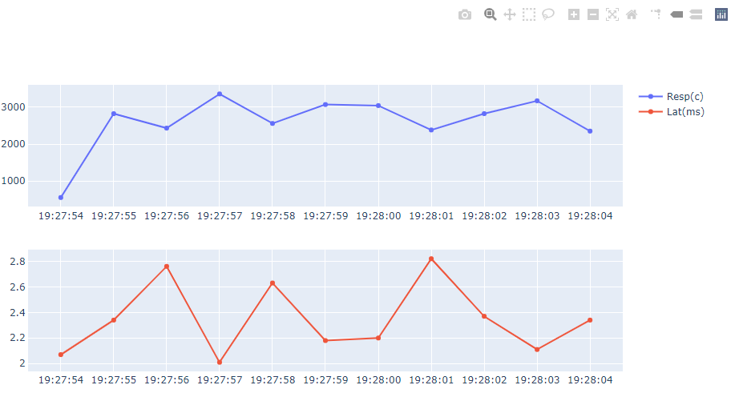

## Plot 

### Install 

```sh
# virtualenv
python3 -v venv venv

# linux
source venv/bin/activate
# windows 
# venv\Scripts\activate

pip install -r requirements.txt
```

### Test 
```sh
# generate plot.html 
./asb -d 10 -c 80 | python3 plot.py
```
---

#### plot.html 
